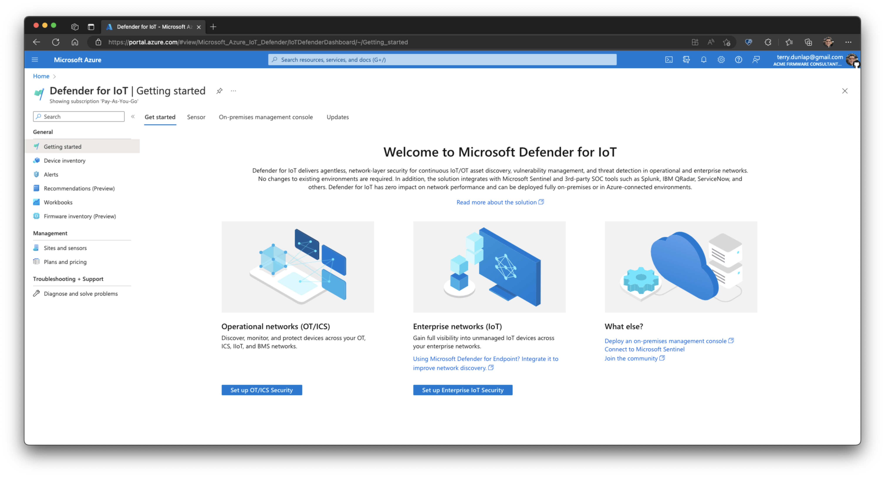

# How to Analyze an IoT/OT Firmware Image

## Current Limitations with Firmware Analysis

IoT/OT devices are built with various types of filesystem-based operating systems, MCUs, and real time operating systems.

Currently, Firmware Inventory is limited in its support of embedded OSes. Today, firmware images must conform to the following limitations:

- Must have physical access to the compiled firmware image.

- Unencrypted, Linux-based firmware image.

- Under 1 GB in size.

## How to Upload a Firmware Image for Analysis

### Step 1

Log into your Azure account and navigate to Defender for IoT.

### Step 2

Click on the **Firmware inventory** menu option.

### Step 3

Click the **Upload** option. A side panel appears on the right called **Upload a firmware image**.

### Step 4

Click **Choose file** then select your firmware image.

### Step 5

Supply the following information:

- Vendor (required)
- Model (required)
- Version (required)
- Description (optional)

### Step 6

Click the **Upload** button.

## How to View the Firmware Analysis Results

### Step 7

Click the row of the firmware you want to view. A side panel appears on the right with basic metadata called **Firmware overview.**

### Step 8

Click the **View results** button for detailed analysis of the firmware image. This brings you to the **Software components** where you can view a software bill of materials that contains:

- list of open source components used to create firmware image
- component version information
- age of component
- update availability
- component license
- executable path (where the binary can be found)

### Step 9

Click **Weaknesses** to view a listing of Common Vulnerabilities & Exposures (CVEs). Click on a specific CVE to open a side panel on the right that reveals additional details about the specific CVE.

### Step 10

Click **Binary Hardening** to view which executables were compiled with the following flags:

- NX
- PIE
- RELRO
- CANARY
- STRIPPED

Click a specific binary to reveal additional information that appears in a side panel on the right.

### Step 11 (Optional)

If you no longer need the firmware image, you have the option to delete it. To delete a firmware image, select the checkbox next to its name and click the **Delete** option near the top.

Once the image is deleted, there is no way to retrieve the image or the associated analysis results. If you need the results, you will need to upload the firmware image again for analysis.

